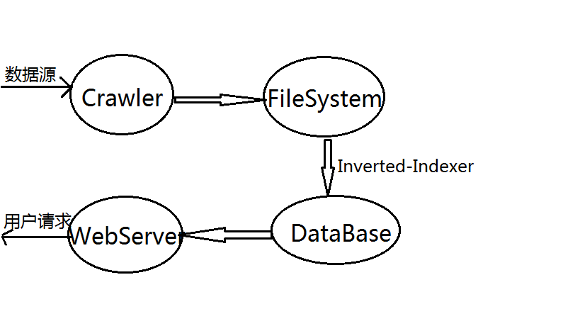
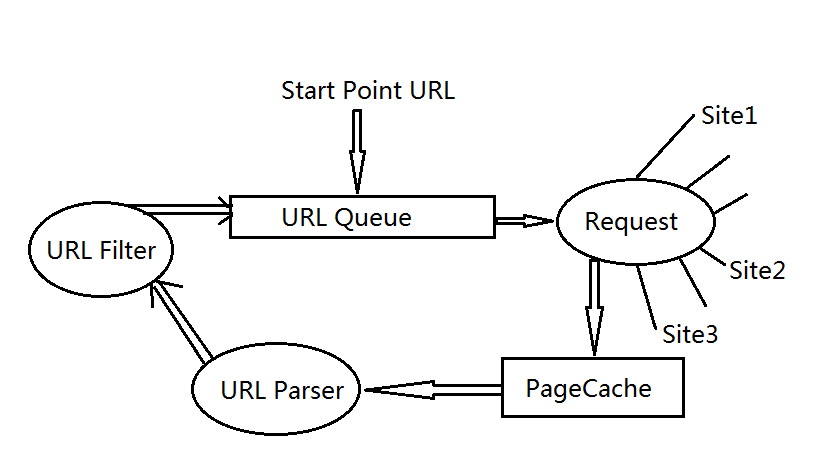
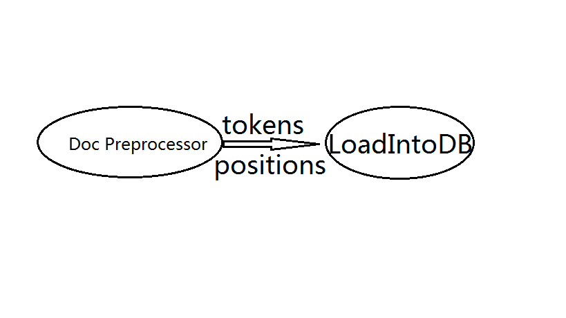
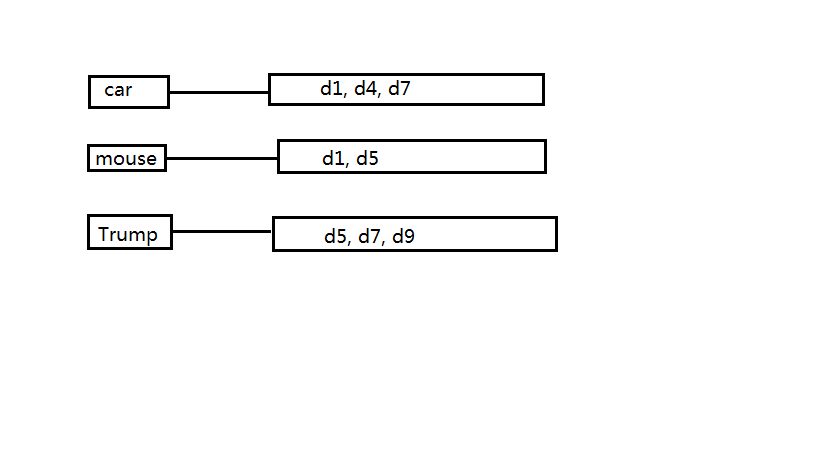
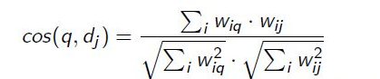

# A Mini Search Engine

## Search Engine Framework

Core Components：Crawler, Indexer builder, WebServer

## Crawler Framwork

## Indexer builder Framwork

## Document Preprocess

Document -> Tokens&Positions

1. convert document raw into lowercase
2. tokenization(get tokens and positions) powered by regexp 
3. drop dirty words(e.g, stop-words and punctuations)
4. stemming

## Load Into Database

Build Indexer(index document-set by token)

## How To Store Indexer

<table>
<tr><td><strong>Table</strong></td><td><strong>Description</strong></td><td><strong>Fields</strong></td></tr>
<tr><td>docs</td><td>document information</td><td>id, path, url, title, word_count, vector_len</td></tr>
<tr><td>terms</td><td>term information</td><td>id, term, doc_freq, inverse_doc_freq</td></tr>
<tr><td>term2doc</td><td>Inverted Index</td><td>term_id, doc_id, term_freq, start, end</td></tr>
</table>

## Builder for indexer

	for document in document-set
		
		doc_id = document.id
		tokens, positions = preprocess(document)
		
		insert_into_table_docs(document.title, document.url, document.word_count, document.path)
		
		tf = term_freq(tokens)
		tokens_set = set()
		for token,position in tokens, positions
			if token in tokens_set
				continue
			tokens_set.add(token)
			
			if term not in table_terms:
				insert_into_table_terms(token)
			
			term_id = get_term_id_from_table_terms(term)
			insert_into_table_term2doc(term_id, doc_id, position.start, position.end, tf[token])

## Search Engine Query Process

1. query is parsed into a list of tokens
2. find documents that have least one query token(bad)
3. query and document vectorization
4. sort document by the similarity with query

## Vectorization

Represent document and query as vectors(consist of term weight)

## Term Weight

How to calucalte TF-IDF? Why TF-IDF?

- TF(Term Freq)

	how many times the term occurs in a document. database table `term2doc`'s `term_freq` field is term freq.(online-work)

- DF(Document Freq)

	how many document contain the term in the data-set. database table `terms`'s `doc_freq` field is document freq.(online-work)

- IDF(Inverse Document Freq)
	
	offline-work

## Vector Similarity

sort query-related document list by the similarity with the query 

## Extract Document Snippet

- Search Engine should return the snippet of document
- get snippet by the position of term